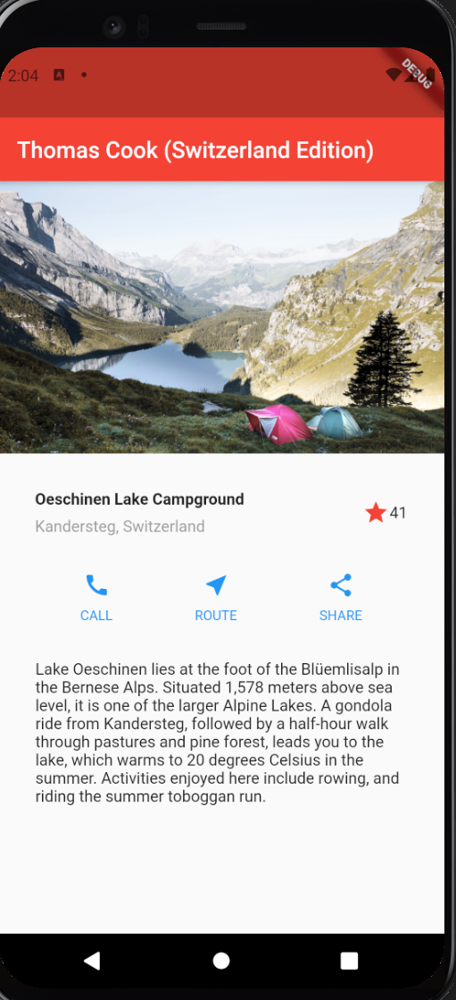
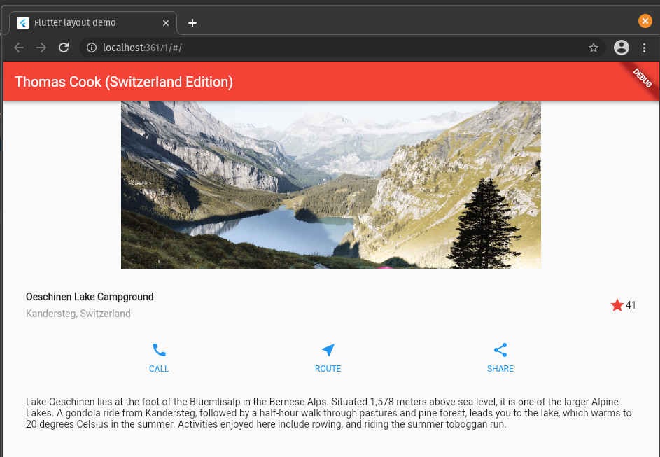

# Thomas Cook Layout (Switzerland Edition)

[](https://nodesource.com/products/nsolid)

[](https://travis-ci.org/joemccann/dillinger)

This code demonstrates Flutter’s approach to layout, and shows how to place a single widget on the screen horizontally and vertically to make a tourist travel app for Switzerland's best attractions.

### IDE

Dart code built and run using IntelliJ Android Studio v4.1.2

### Prerequisites and Running on Discovery Cluster

1. Clone the repo from Github and change into the main project directory:
    ```sh
    $ git clone https://github.com/NEU-GradStudents/class-exercise-3-srinjoychakravarty.git

    $ cd class-exercise-3-srinjoychakravarty
    ```

2. Clean, get and upgrade Flutter and Dart packages to avoid compilation issues:
    ```sh
    $ eval $which flutter --version
    $ eval $which flutter clean
    $ eval $which flutter pub get
    $ eval $which flutter pub upgrade
    $ eval $which dart pub get
    ```
3.  Open Android Studio to inspect the main Dart code in the following directory:
    ```sh
    $ cd lib/
    $ eval $which android-studio
    ```

    **Tip:** the main Dart code can be found at /lib/main.dart

    | Warning! :warning: Set up an Android Emulator from the menu bar using `Tools > AVD Manager`  |

<br/>

6. Select your android emulator form the dropdown box and power it on and then click the green play button to auto compile and render to Android
<br/>
<br/>

   
<br/>
<br/>

7. Additionally you can select `Chrome (web)` from the same dropdown box and render the Dart code as a native Web App if you have preconfigured the necessary drivers from the official website
    <br/>

    
    <br/>

License
----

Northeastern University

_Srinjoy Chakravarty_